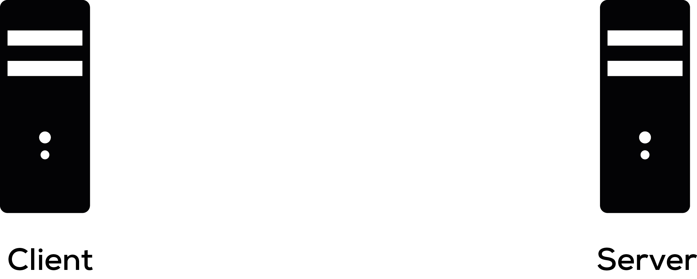
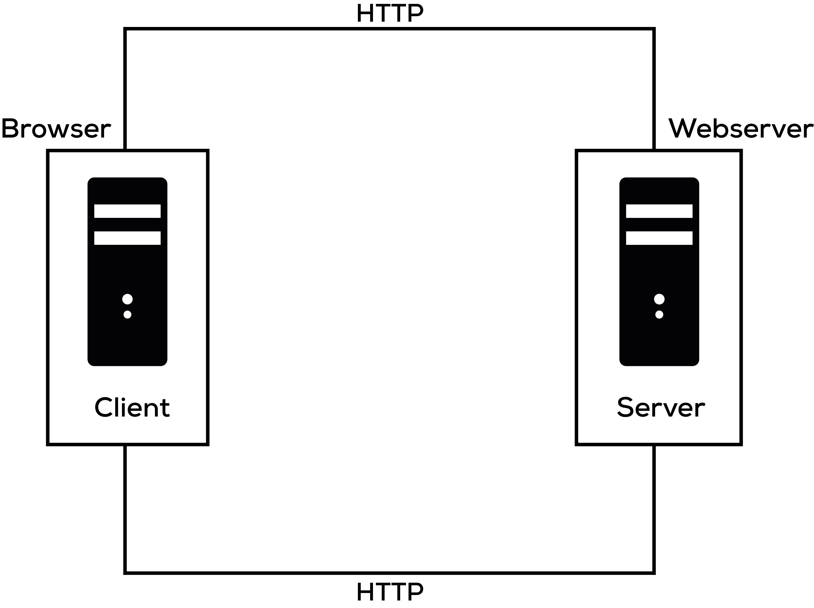
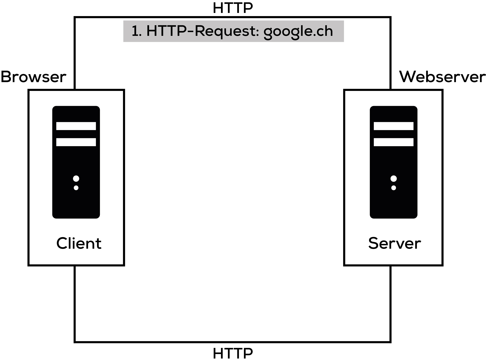
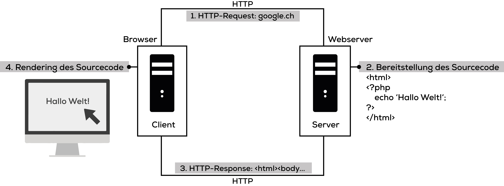
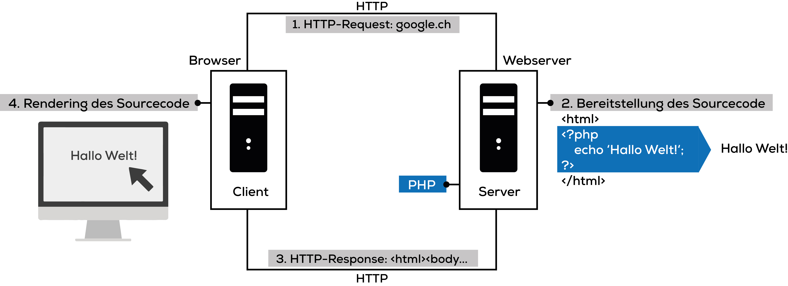
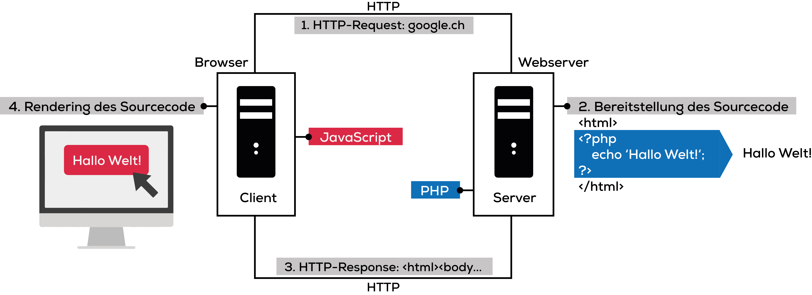

# Server-Client-Infrastruktur

### Client und Server
> Ein __Server__ ist ein Programm, das mit einem anderen Programm kommuniziert, dem Client. Dabei verschafft der Server dem Client Zugang zu einem Dienst. Hierbei muss abgrenzend beachtet werden, dass es sich bei «Server» um eine Rolle handelt, nicht um einen Computer an sich. Ein Computer kann dementsprechend ein Server und Client zugleich sein.

> Ein __Client__ kann einen Dienst bei einem Server anfordern, welcher diesen Dienst bereitstellt.

### Kommunikationsprotokoll HTTP

> Hyper Text Transfer Protocol (HTTP) ist ein Protokoll für den Transfer von Daten, in unserem Fall Websites (wie die Website, welche du gerade betrachtest). Ein Protokoll ist nichts anders als ein Standard etwas zu tun.

> Angenommen du trifft den Präsident der Vereinigten Staaten oder die Queen von England. In diesen beiden Fällen gibt es bestimmte Prozeduren, welchen du befolgen musst. Du kannst nicht einfach zu dieser Person hinlaufen und sagen «Hey Alter!» oder «Was geht ab, Brudi!». Es gibt bestimmte Vorschriften beim Gehen, beim Sprechen, bei der Begrüssung und auch bei der Verabschiedung.

### Aufbau einer URL

```
http://www.website.com/suchen.html?q=Suchbegriff&page=1#treffer-5
```

|          Teil         |      Bezeichnung       |                                                                   Bedeutung                                                                   |
|-----------------------|------------------------|-----------------------------------------------------------------------------------------------------------------------------------------------|
| http://               | Protokoll              | Sagt dem Browser, welches Protokoll er zum Aufruf der URL verwenden soll. Andere Protokolle sind z. B. HTTPS oder FTP.                        |
| www.website.com       | Domainname             | Sagt dem Browser, zu welchem Server er die Verbindung aufbauen soll. Der Domainname wird via DNS in eine IP-Adresse umgewandelt.              |
| /suchen.html          | Dateipfad              | Sagt dem Browser, welche Datei er ab dem Server aufrufen soll.                                                                                |
| ?q=Suchbegriff&page=1 | Query-String/Parameter | Parameter, die der Datei übergeben werden. Beginnend mit `?` werden sie jeweils als `schlüssel=wert`-Paare getrennt von `&` der URL angefügt. |
| #treffer-5            | Anker                  | Verweist auf eine bestimmte Stelle innerhalb des Dokuments. Diese Stelle kann z. B. mit einem `id="treffer-5"` Attribut in HTML definiert werden. |

### Aufbau eines HTTP-Requests

```
POST /pfad/zu/script.php HTTP/1.0
User-Agent: Chrome/31.0
Content-Type: application/x-www-form-urlencoded
Content-Length: 32

suchbegriff=test&encoding=utf8
```

Ein HTTP-Request besteht aus einem Header und einem Body. Im Header werden Informationen wie die HTTP-Methode (`POST`) oder die zu ladende Datei definiert. Es können auch weitere Details zum Inhalt des Requests angegeben werden (beispielsweise ein `Content-Type`).

Im Body eines HTTP-Requests können Daten an den Server mitgesendet werden. Die Daten werden hier im gleichen `Query-String`-Format übergeben, wie man sie auch direkt in der URL übergeben kann.

#### Basis Beispiel: Aufruf einer Website

1. Der __Benutzer__ öffnet seinen Browser (den Client).
2. Der __Benutzer__  öffnet die Website `http://google.ch/`.
3. Der __Client__ (auf Befehl des Benutzers), sendet eine Anfrage zum __Server__ `http://google.ch/` für die Website.
4. Der __Server__ erkennt die Anfrage und antwortet dem __Client__ mit den Meta-Daten, gefolgt vom Sourcecode der Website.
5. Der __Client__ empfängt den Sourcecode der Website und übersetzt diesen in eine für den __Benutzer__ lesbare Website.
6. Der __Benutzer__ tippt das Suchwort `ICT Berufsbildung` in das Suchfeld und drückt Enter.
7. Der __Client__ übermittelt die Daten (das Suchwort) zum __Server__.
8. Der __Server__ verarbeitet diese Daten und sendet die Resultate am __Client__ zurück.
9. Wieder übersetzt der __Client__ den erhaltenen Sourcecode vom __Server__ zu einer für den __Benutzer__ lesbaren Website.

#### Erweiterter Ablauf mit HTML, JavaScript und PHP

Wie bereits erwähnt besteht ein Aufruf immer aus einem __Server__ und einem __Client__



Der __Server__ und der __Client__ kommunizieren mit dem HTTP Protokoll untereinander. Damit ist es für den __Client__ möglich Anfragen an den __Server__ zu senden und die Antwort darauf zu erhalten.


Der __Client__ und __Server__ müssen keine getrennten Harware-Systeme sein, sondern können auf dem gleichen Rechner installiert werden. Dabei besteht der __Client__ aus dem Browser und der __Server__ aus einem Webserver.



Der __Client__ schickt einen HTTP-Request `http://google.ch` [1].



Der __Server__ empfängt den Request und stellt darauf die Daten bereit, sprich den Sourcecode [2]. Diese Daten schickt er anschliessend dem __Client__ zurück [3].


Der __Client__ empfängt die HTTP-Response des Servers und wandelt den Sourcecode in eine für den Menschen lesbare Form um: Die Website [4].



Bestimmte Code-Schnippsel müssen aber nicht einfach nur abgerufen und angezeigt werden, sonder ebenfalls noch interpretiert. Serverseitig hält deshalb ein PHP-Interpretator Ausschau nach PHP-Code, um diesen auszuführen.



Das gleiche passiert nach der Übertragung zum __Client__ durch den JavaScript-Interpretator.



Die umhergereichten Daten können beispielsweise im Browser in den Developer Tools (F12) unter "Network" betrachtet werden.
