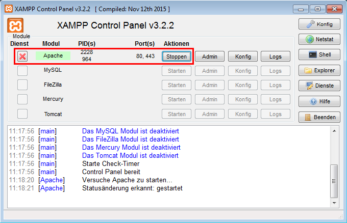

# Einrichtung Entwicklungsumgebung

## Webserver

Als Webserver verwenden wir Apache mit PHP 7. Um die Installation zu vereinfachen, greifen wir auf XAMPP zurück.

XAMPP ist ein Software-Paket, welches die Installation von Apache mit PHP auf Linux, Mac und Windows vereinfacht. XAMPP sollte nur für Entwicklungszwecke und nicht für den produktiven Betrieb verwendet werden.

### Installation von XAMPP

1. Führe das XAMPP-Setup aus. Du findest den Installer auf dem Austausch-Laufwerk.
2. Es reicht aus, dass Du nur die folgenden Komponenten installierst: Apache, PHP.
3. Installiere XAMPP ins Verzeichnis `C:\xampp`
4. **Deaktiviere die Option «Learn more about Bitnami for XAMPP»**

### XAMPP Control Panel

Das XAMPP Control Panel startet nach erfolgreicher Installation automatisch. Falls nicht, findest Du es im Startemenü.

Nach dem Starten wird das CP im Systemtray neben der Uhr angezeigt. Klicke das Icon an um das Fenster zu öffnen.

Das CP ermöglicht Dir, die XAMPP-Dienste zu starten und zu stoppen.

Stelle sicher, dass Du den Apache-Dienst erfolgreich starten und stoppen kannst.



Besuche in Deinem Browser die URL [`http://localhost`](http://localhost). Wenn alles funktioniert, solltest Du nun die XAMPP-Begrüssungsseite sehen.


### Das `htdocs` Verzeichnis

Unter `C:\xampp\htdocs` befindet sich der so genannte `DocumentRoot` deines Servers. Alle Dateien aus diesem Verzeichnis sind direkt via `http://localhost` zugänglich.

1. Lösche alle mitgelieferten Dateien im `htdocs` Verzeichnis.
2. Lade [`http://localhost`](http://localhost) in Deinem Browser neu - du solltest nun eine Fehlermeldung erhalten.
3. Erstelle den Ordner `url-test` und darin die Datei `test.txt`.
4. Schreibe etwas in die Textdatei.
5. Du kannst diese Datei nun via `http://localhost/url-test/test.txt` aufrufen.

#### `DirectoryIndex`

Wenn Du über die URL ein Verzeichnis aufrufst, ohne eine Datei anzugeben, wird Apache automatisch eine der folgenden Dateien laden, sofern diese existiert:

> **index.php** index.pl index.cgi index.asp index.shtml **index.html** **index.htm** default.php default.pl default.cgi default.asp default.shtml default.html default.htm home.php home.pl home.cgi home.asp home.shtml home.html home.htm

Benenne Deine `test.txt` in `index.html` um und rufe im Browser `http://localhost/url-test/` auf. Die `index.html` wird jetzt automatisch geladen.


## Editor

Um produktiv arbeiten zu können, solltest du einen modernen Text-Editor verwenden. Welchen Editor du für diesen ÜK verwendest, ist dir überlassen. WYSIWYG-Editoren wie zum Beispiel Dreamweaver sind nicht erlaubt.

Es ist von Vorteil, wenn der Editor deiner Wahl Plugins unterstützt.

### Empfehlungen

Wir empfehlen dir einen der folgenden Editoren zu benutzen und die weiter unten aufgeführten Plugins zu installieren.

#### Sublime Text

1. Installer vom Austausch-Laufwerk starten und das Setup ausführen.
2. Das Programm `Sublime Text` starten.
3. Im Menü auf `View -> Show Console` klicken.
4. Folgender Code in der Konsole einfügen und Enter drücken.

```
import urllib.request,os,hashlib; h = '2915d1851351e5ee549c20394736b442' + '8bc59f460fa1548d1514676163dafc88'; pf = 'Package Control.sublime-package'; ipp = sublime.installed_packages_path(); urllib.request.install_opener( urllib.request.build_opener( urllib.request.ProxyHandler()) ); by = urllib.request.urlopen( 'http://packagecontrol.io/' + pf.replace(' ', '%20')).read(); dh = hashlib.sha256(by).hexdigest(); print('Error validating download (got %s instead of %s), please try manual install' % (dh, h)) if dh != h else open(os.path.join( ipp, pf), 'wb' ).write(by)
```

Warte bis der Prozess abgeschlossen ist. Die Fehlermeldung bezüglich der «1 missing dependency» kannst du ignorieren.

Starte Sublime-Text anschliessend neu.

##### Plugins installieren

Um Plugins zu installieren, drücke die Tastenkombination `Ctrl + Shift + P` und gib `Install Package` ein. Drücke `Enter`. Du kannst jetzt den Namen des Plugins eingeben, mit den Pfeiltasten auswählen und mit `Enter` installieren.

#### Atom

1. Installer vom Austausch-Laufwerk starten und das Setup ausführen.
2. Das Programm `Atom` starten.

##### Plugins __installieren__

Um Plugins zu installieren, gehe im Menü auf `File -> Settings -> Install`. Du kannst jetzt den Namen eines Plugins eingeben und es über den «Install»-Button installieren.

#### Brackets

1. Installer vom Austausch-Laufwerk starten und das Setup ausführen.
2. Das Programm `Brackets` starten.

##### Plugins installieren

Um Plugins zu installieren, gehe im Menü auf `Datei -> Erweiterungs-Verwaltung...`. Du kannst jetzt den Namen eines Plugins eingeben und es über den «Installieren»-Button installieren.


### Plugin-Empfehlungen

Folgende Plugins kannst du installieren, um dir das Arbeiten etwas zu vereinfachen.

#### Emmet

Emmet ermöglicht es dir, einen CSS-Selektor via TAB-Taste in die entsprechende HTML-Struktur umzuwandeln.

```
a  -> TAB-Drücken

// ergibt:
<a href=""></a>
_____________________________

h1{Überschrift}+p{Absatz}  -> TAB-Drücken

// ergibt:
<h1>Überschrift</h1>
<p>Absatz</p>
_____________________________

ul>li{Punkt $}*3  -> TAB-Drücken

// ergibt:
<ul>
    <li>Punkt 1</li>
    <li>Punkt 2</li>
    <li>Punkt 3</li>
</ul>
```

#### PHP Hints

Autocomplete-Funktionen, die Dir bei der Eingabe von PHP-Code helfen, kannst Du über folgende Plugins erhalten:

|    Editor    |      Plugin Name      |
|--------------|-----------------------|
| Sublime Text | PHP Completions Kit   |
| Atom         | atom-autocomplete-php |
| Brackets     | PHP SmartHints        |

##### Hinweis zu `atom-autocomplete-php`:

Wird bei der Installation ein Fehler ausgeben, gehe nach der Installation in die Plugin-Einstellungen und gib unter `Command php` folgenden Wert ein:

```
c:\xampp\php\php.exe
```

Starte Atom anschliessend neu.

Du wirst jetzt zwar immer noch eine Fehlermeldung erhalten, jedoch funktioniert die Autovervollständigung trotzdem.

`¯\_(ツ)_/¯`
