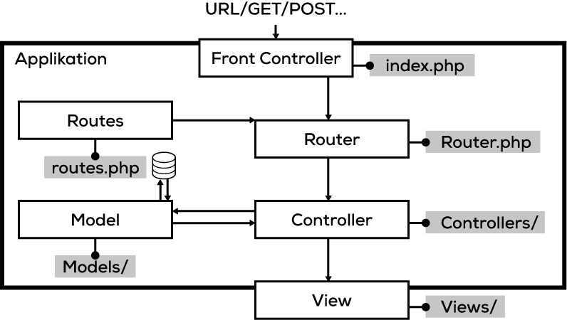

# Strukturierung

Selbst mit unserem relativ einfachen Tool wird sehr schnell klar, dass beim Platzieren des kompletten Codes in einem Ordner die Übersicht verloren geht.

Die Strukturierung einer Webapplikation ist ein wichtiger Bestandteil und sollte nicht vernachlässigt werden. Wie du die Applikation strukturierst, ist dir überlassen. Es gibt jedoch klare Komponenten, die jede Webapplikation besitzt und die irgendwo untergebracht werden müssen.

## Das MVC-Konzept

([Zum schrittweisen Aufbau der Applikations-Struktur](res))

## Komponenten

### Model, View, und Controller (MVC)

Ein Router delegiert eine Anfrage oft an einen `Controller`. Dieser verwaltet dann den Datenaustausch zwischen einem `Model` und einer `View`. Das Model dient als Schnittstelle zu einer Datenquelle (z. B. einer Datenbank). Die View dient zur Darstellung der Daten.

* Ein Benutzer interagiert mit einer `View` - in dem er auf einen Link klickt oder ein Formular absendet.
* Ein `Controller` bearbeitet den Benutzer-Input und übersetzt die Daten für das Model.
* Das `Model` empfängt die Daten, verändert diese (schreibt sie in eine Datenbank, macht eine Kalkulation oder löscht etwas).
* Der `Controller` nimmt die Daten wieder entgegen und gibt diese falls nötig an eine `View` weiter.
* Die `View` wartet wiederum für die nächste Interaktion mit dem Benutzer.

Diese drei Komponenten werden in der für Webapplikationen sehr beliebten MVC-Architektur verwendet. Dies ist jedoch nur eine von vielen gängigen Architekturen.

### Front-Controller

Als Front-Controller bezeichnen wir den «Einstiegspunkt» unserer Webapplikation. Über diesen wird **jeder** Seitenaufruf entgegengenommen und dann verarbeitet.

In unserem Fall haben wir mit der `index.php` bereits einen Front-Controller erstellt. 

### Router

Wenn der Front-Controller einen Request entgegennimmt, muss dieser herausfinden, was damit geschehen soll. Dafür wird oft ein `Router` erstellt. Dieser definiert, wie eine spezieifsche Anfrage/URL verarbeitet werden soll.

### Templates

Ein Template ist die Grundlage für die Darstellung einer Webpage. Diese kann sich aus verschiedenen Views zusammensetzen. Oft wird zwischen Template und View gar nicht unterschieden. Einfachheitshalber wird alles als View bezeichnet.

## Eine kleine Geschichte dazu

Peter Pichler hat nach den Ferien das Passwort seines Computers in der Firma vergessen. 

Er ruft bei seinem IT-Spezialisten auf die Support-Hotline an und stellt eine Anfrage zur Wiederherstellung des Passworts `(Benutzer-Interaktion)`. 

Der nette Herr Müller vom Support nimmt die Anfrage entgegen (`Front-Controller`) und schaut im System (`Routes`) nach, wer für das Projekt zuständig ist. 

Nach kurzer Recherche leitet er die Anfrage von Herrn Müller weiter (`Router`) und Frau Maurer (`Controller`) nimmt sie entgegen. 

Diese öffnet das Kundendaten-Tool, gibt die Kundennummer von Herrn Pichler ein und erhält das Admin-Passwort für die Installation von Herrn Pichler (`Model`).

Nun setzt Frau Maurer das Passwort auf das Standard-Passwort *123456* zurück und schreibt ihm eine Email mit allen nötigen Daten (`View`).

## Vereinfachte MVC-Architektur für unser Projekt

Da die Umsetzung einer MVC-Architektur ohne objektorientierten PHP-Code etwas umständlich ist, versuchen wir für unser Projekt eine vereinfachte Struktur zu erstellen, die sich aber an der MVC-Architektur orientiert.

Es sollen folgende Komponenten vorhanden sein.

* Front-Controller
* Router
* Model
* Controller
* Views