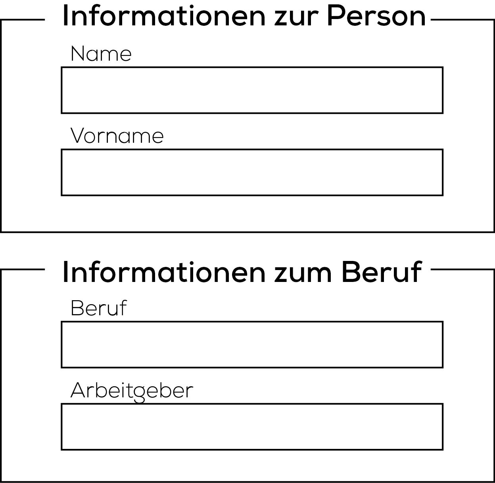

# Informationsgruppierung

Die Übertragung von Informationen mit Hilfe eines Formularfeldes folgt klaren Regeln und Strukturen. Somit lassen sich Formularelemente grundsätzlich in drei hierarchische Stufen unterteilen:

1. Formularfelder (Textfeld, Checkbox, Radio-Box...)
2. Formularfeld-Gruppe (Fieldset)
3. Formular

### 1. Formularfeld

Die Formularfelder sind die kleinsten Elemente innerhalb eines Formulars. Die verschiedenen Typen ermöglichen es dem Benutzer Informationen einzugeben (Textfelder, Checkboxen...) und/oder definierte Aktionen des Formulars auszulösen (Submit, Reset).

```html
<label for="firstname">Vorname</label>
<input type="text" id="firstname">

<label for="lastname">Nachname</label>
<input type="text" id="lastname">

<label for="work">Beruf</label>
<input type="text" id="work">

<label for="workplace">Arbeitgeber</label>
<input type="text" id="workplace">
```

Als kleine Illustration:


Zur Repetition befindet sich unter folgendem Link ein kleines Cheatsheet zum Thema Formularfelder:

[Übersicht der Formularfelder](http://www.offlinegmbh.ch/vfi/formulare.html)

### 2. Formularfeld-Gruppen

Das Tag `fieldset` ermöglicht es dem Benutzer die Formularfelder in Sets/Gruppen zu strukturieren. Ausschlaggebend für die Unterteilung ist die thematische Zusammengehörigkeit der einzelnen Felder.

Die Formularfeld-Gruppen erleichtern zum einen die Navigation innerhalb des Dokuments und erhöhen gleichzeitig die Accessability der Seite.

```html

<fieldset>

    <legend>Informationen zur Person</legend>

    <label for="firstname">Vorname</label>
    <input type="text" id="firstname">

    <label for="lastname">Nachname</label>
    <input type="text" id="lastname">

</fieldset>

<fieldset>

    <legend>Informationen zum Beruf</legend>
        
    <label for="work">Beruf</label>
    <input type="text" id="work">

    <label for="workplace">Arbeitgeber</label>
    <input type="text" id="workplace">

</fieldset>

```

Als keine Illustration:



Accessability/Barrierefreiheit: Kommunikation in der Weise, dass sie von Menschen mit Behinderung und von älteren Menschen in derselben Weise genutzt werden kann, wie von Menschen ohne Behinderung.

### 3. Formular

Das `form` Tag ist auf der höchsten strukturellen Ebene eines Formulars und beinhaltet sämtliche Formularfelder und Formularfeld-Gruppen. Ein Formularfeld zeigt folgende Charakteristiken:

* Das `form` Tag verfügt über kein Aussehen. Das Aussehen wird von den darin enthaltenen Elementen bestimmt.
* Das `form` Tag definiert die Handhabung eines kompletten und abgesendeten Formulars (mit Hilfe des `action` Attributs).
* Das `form` Tag definiert die Methode, mit welcher die Daten versendet werden.


```html

<form action="http://ict-bz.ch/process.php" method="post">

    <fieldset>
        
        <legend>Informationen zur Person</legend>

        <label for="firstname">Vorname</label>
        <input type="text" id="firstname">

        <label for="lastname">Nachname</label>
        <input type="text" id="lastname">

    </fieldset>

    <fieldset>

        <legend>Informationen zum Beruf</legend>
            
        <label for="work">Beruf</label>
        <input type="text" id="work">

        <label for="workplace">Arbeitgeber</label>
        <input type="text" id="workplace">

    </fieldset>

    <button type="submit" name="form-submit">Anmeldung einreichen</button>

</form>

```


Als keine Illustration:

