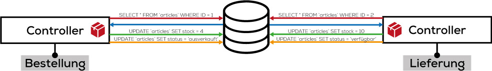
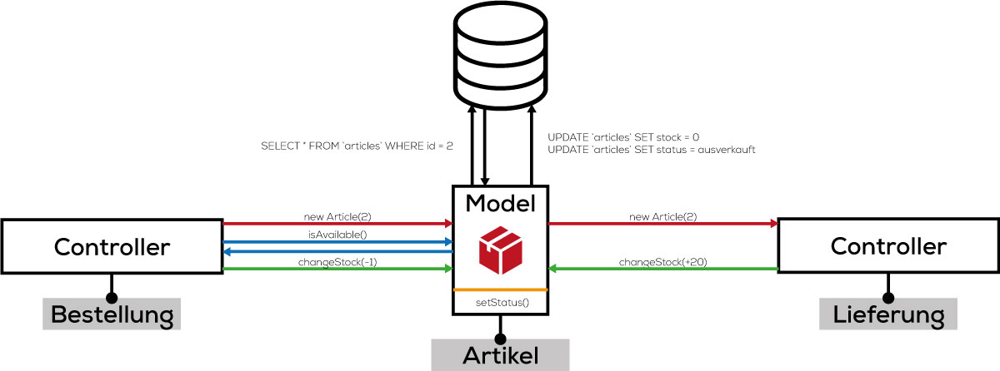

# Models
Im Moment werden sämtliche Aufgaben des Tools von den Controllern und den Views ausgeführt. Die Logik ist zwar von der Darstellung getrennt, jedoch ist die Datenverarbeitung noch ein integrativer Bestandteil der Logik, beziehungsweise des Controllers.

Dies führt früher oder später zu folgenden Problemen:
* Einige Code-Elemente müssen doppelt aufgeführt werden (DRY)
* Änderungen der Infrastruktur (z. B. Datenbank-Technologie) führenr zu einem grossen Umstrukturierungsaufwand.
* Die Code-Struktur im Controller wird unübersichtlich.
* Der Code ist schlecht lesbar.

#### Folgendes Beispiel dazu...
Wir haben einen Controller `Bestellung`, der sämtliche Bestellungen eines Online-Shops steuert. Bei einer Bestellung passieren folgende Abläufe:

1. Der Controller ruft den Artikel in der Datenbank ab und speichert die Informationen bei sich zwischen.
2. Der Controller überprüft in den erhaltenen Informationen ob der Warenbestand des Artikels grösser als 1 ist.
3. Der Controller speichert den alten Warenbestand minus 1 in der Datenbank ab.
4. Der Controller überprüft, ob der neue Warenbestand grösser als 0 ist. Wenn nein, muss der Controller noch zusätzlich den Status des Artikels auf `ausverkauft` in der Datenbank abändern.


Wir haben einen Controller `Lieferung`, der sämtliche Warenlieferungen von Lieferanten ans Lager steuert. Bei einer Lieferung passieren folgende Abläufe:

1. Der Controller ruft den Artikel in der Datenbank ab und speichert die Informationen bei sich zwischen.
2. Der Controller addiert die Lieferung mit dem alten Warenbestand und speichert den neuen Warenbestand in die Datenbank.
3. Sofern der Warenbestand vorher auf 0 war, setzt der Controller den Status wieder auf `verfügbar`.



#### Fazit - Datenverarbeitung mit dem Controller
Beide Controller führen ähnliche Interaktionen mit der Datenbank aus:
* Artikelinformationen abrufen
* Neuer Warenbestand speichern
* Neuer Status speichern

Es entstehen eine Vielzahl an fast identischem, doppeltem Code. Ebenfalls müssen sich die Controller um die Zwischenspeicherung von Daten (Warenbestand) kümmern.

#### Model
Um genau diese Problemstellungen zu umgehen, wird mit einem Model gearbeitet. Das Model ist für die Entgegennahme, Bearbeitung und Speicherung der Daten zuständig. Für unser Beispiel, hat dies die folgenden Auswirkungen:

##### Controller: Bestellung

1. Der Controller instanziert ein Artikel-Objekt mit der dazugehörigen Id.
2. Der Controller ruft die Methode `isAvailable` auf und erhält je nach Warenbestand ein `TRUE` oder ein `FALSE` zurück.
3. Sind noch Waren im Lager, kann der Controller die Methode `changeStock` aufrufen. Anhand dieser Methode berechnet das Model den neuen Warenbestand und speichert diesen in die Datenbank. Ebenfalls wird bei jeder Änderung des Warenbestandes gleichzeitig überprüft ob der Bestand noch grösser als 0 ist und allenfalls der Status aktualisiert werden muss.

##### Controller: Lieferung

1. Der Controller instanziert ein Artikel-Objekt mit der dazugehörigen Id.
2. Der Controller ruft die Methode `changeStock` auf mit der Anzahl gelieferter Waren. Das Model aktualisiert nun den Warenbestand und den Status.




#### Fazit - Datenverarbeitung mit dem Model
Beide Controller führen immer noch ähnliche Interaktionen aus:
* Artikelinformationen abrufen
* Neuer Warenbestand speichern
* Neuer Status speichern

Der Code ist jedoch jetzt zentral im Model hinterlegt und muss nicht doppelt geschrieben werden. Ebenfalls müssen sich die beiden Controller nicht mehr um die Zwischenspeicherung der Daten kümmern. Dazu kommt noch, dass standardisierte Abläufe (Überprüfung des Warenbestands für den Status) zentral hinterlegt werden können.

## Aufgabe: Refactoring Task-Liste (Gemeinsam)
Erstelle nun das Model `Task.php` und binde dieses in deinen Bootstrapper ein. Erstelle darin die Klasse `Task`. Unser Ziel ist es nun, dass wir den Code in den einzelnen Controller lesbarer machen, Wiederholungen vermeiden (DRY) und fast die komplette Datenbank-Kommunikation in das Model `Task` auslagern. 

### Konstruktor
Als erstes Erstellen wir einen Konstruktor für die Klasse. Dieser soll sämtliche Attribute bei der Instanzierung einer Klasse entgegennehmen und im erstellten Objekt abspeichern.

```php
    public $id;
    public $title;
    public $completed;

    function __construct($title, $completed)
    {
        $this->title = $title;
        $this->completed = $completed;
    }
```

### Refactoring: Controller
Der Controller soll so angepasst werden, dass sich nur noch die Logik darin befindet. Alles andere soll durch das Model `Task` ausgeführt werden. Gehe dabei immer in zwei Schritten vor:

1. Schreibe den Code, wie du ihm im Controller haben möchtest.
2. Ergänze den Code im Model so, dass er gemäss deinen Vorstellungen funtkioniert.

##### Refactoring: AddTaskController.php
```php
$task = new Task("Titel des Tasks", false);
$task->create();
```

##### Refactoring: EditTaskController.php
```php
$task = new Task();
$task = $task->getTaskById($id);
```

##### Refactoring: UpdateTaskController.php
```php
$task = new Task($_POST['title'], $completed);
$task->update($_GET['id']);
```

### Refactoring: DeleteTaskController.php
Versuche nun eigenständig noch die Logik und Datenverarbeitung vom `DeleteTaskController` zu trennen.