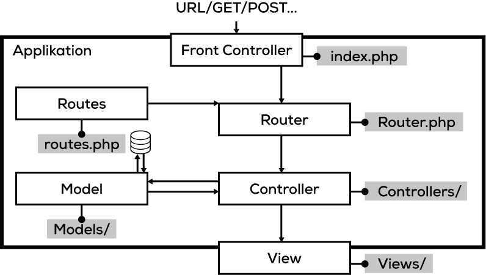

# 05 Strukturierung

Selbst mit unserem relativ einfachen Tool wird sehr schnell klar, dass beim Platzieren des kompletten Codes in einem Ordner die Übersicht verloren geht.

Die Strukturierung einer Webapplikation ist ein wichtiger Bestandteil und sollte nicht vernachlässigt werden. Wie du die Applikation strukturierst, ist dir überlassen. Es gibt jedoch klare Komponenten, die jede Webapplikation besitzt und die irgendwo untergebracht werden müssen.

## Das MVC-Konzept



\([Zum schrittweisen Aufbau der Applikations-Struktur](res.md)\)

## Komponenten

### Model, View, und Controller \(MVC\)

Ein Router delegiert eine Anfrage oft an einen `Controller`. Dieser verwaltet dann den Datenaustausch zwischen einem `Model` und einer `View`. Das Model dient als Schnittstelle zu einer Datenquelle \(z. B. einer Datenbank\). Die View dient zur Darstellung der Daten.

* Ein Benutzer interagiert mit einer `View` - in dem er auf einen Link klickt oder ein Formular absendet.
* Ein `Controller` bearbeitet den Benutzer-Input und übersetzt die Daten für das Model.
* Das `Model` empfängt die Daten, verändert diese \(schreibt sie in eine Datenbank, macht eine Kalkulation oder löscht etwas\).
* Der `Controller` nimmt die Daten wieder entgegen und gibt diese falls nötig an eine `View` weiter.
* Die `View` wartet wiederum für die nächste Interaktion mit dem Benutzer.

Diese drei Komponenten werden in der für Webapplikationen sehr beliebten MVC-Architektur verwendet. Dies ist jedoch nur eine von vielen gängigen Architekturen.

### Front-Controller

Als Front-Controller bezeichnen wir den «Einstiegspunkt» unserer Webapplikation. Über diesen wird **jeder** Seitenaufruf entgegengenommen und dann verarbeitet.

### Router

Wenn der Front-Controller einen Request entgegennimmt, muss dieser herausfinden, was damit geschehen soll. Dafür wird oft ein `Router` erstellt. Dieser definiert, wie eine spezieifsche Anfrage/URL verarbeitet werden soll.

## Das ÜK-Framework

Für den ÜK steht ein einfaches MVC-Framework zur Verfügung: 

1. Lade das <a download="_Framework.zip" href="../../../../raw/master/.source/_Framework.zip">_Framework.zip</a> herunter.
2. Erstelle einen Ordner `aufgaben` in `C:\xampp\htdocs\modul-307\` und extrahiere das Framework da. 
3. Ergänze später je Aufgabe die benötigten Routes-Einträge in `index.php`, sowie die nötigen Controller, Models und Views. 

### index.php

Die `index.php` ist der Einstiegspunkt für alle Anfragen an unser Framework. Hier wird das Framework geladen \(`core/bootstrap.php`\), `$routes` werden definiert und anschliessend ausgeführt.

### Routes definieren

Über die `$routes` Variable in der `index.php` lassen sich beliebig viele Routes definieren:

```php
$routes = [
    '/hallo/welt' => 'WelcomeController@index',
];
```

Im obenstehenden Beispiel wird beim Aufruf von `http://localhost/modul-307/aufgaben/hallo/welt` die `index` Methode auf dem `WelcomeController` ausgeführt.

Die `Controller@Methode` Schreibweise ist vom Framework vorgegeben. Der `Router` kann anhand dieser Schreibweise entscheiden, welche Controller-Methode aufgerufen werden soll.

### Controller

Im Ordner `app/Controllers` werden alle Controller-Klassen abgelegt. In den einzelnen Methoden können Variablen definiert werden. Am Ende einer Controller-Methode wird üblicherweise via `require` eine View geladen.

```php
<?php
class WelcomeController
{
    public function index()
    {
        $hello = 'Viel Spass beim Programmieren!';

        require 'app/Views/welcome.view.php';
    }
}
```

### Views

Im `app/Views` Ordner können einzelne View-Dateien abgelegt werden. In diesen sollte nur noch sehr wenig PHP-Code vorhanden sein! Es sollten lediglich einfache `if` und `foreach` Statements verwendet werden. Aufwändigere Logik gehört in den Controller oder separate Klassen.

### Helpers

In der Datei `core/helpers.php` gibt es ein paar nützliche Funktionen. Schaue diese an und versuche sie zu verstehen!

### Public

Alle CSS, JS und Bild-Dateien gehören in den `public` Ordner.

