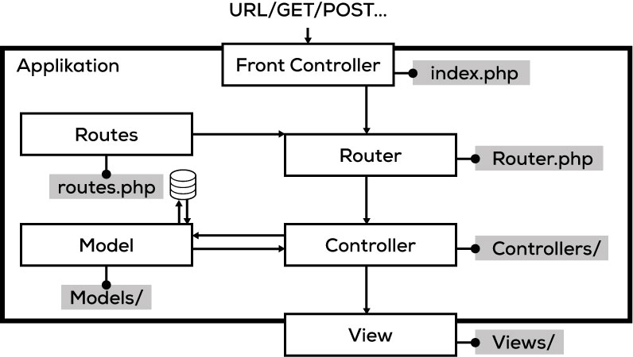

# Aufbau eines MVC (Schritt für Schritt)

## Applikation

.jpg>)

## HTTP-Anfrage

.jpg>)

## Front-Controller

.jpg>)

## Router

.jpg>)

## Routes

.jpg>)

## Controller

.jpg>)

## Model

.jpg>)

## Datenbank

.jpg>)

## View

