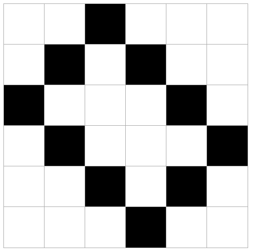

# 04 Pixelgenerator


## Aufgabenstellung

Erstelle ein PHP-Script, welches aufgrund der mitgegebenen GET-Variablen eine Tabelle zur Darstellung eines Pixelbildes generiert.

### Zielumgebung

Nutze zur Strukturierung des Codes die erstellte MVC-Umgebung:

`PixelController.php` =&gt; Logik `pixel.view.php` =&gt; Ausgabe

### Lösungsschritte

Entwickle das Script immer nur so weit, bis alle Komponenten des jeweiligen Schrittes komplett erfüllt werden. Erweitere es anschliessend, damit der nächste Schritt erfüllt wird.

#### Schritt 1

Erstelle eine einfache HTML-Seite ohne PHP-Code. Auf der Seite soll eine Tabelle mit 4 Spalten und 4 Zeilen angezeigt werden.

Kopiere das Stylesheet `src/styles.css` in dein Verzeichnis und binde es in das Dokument ein.

Du solltest nun eine vertikal und horizontal zentrierte Tabelle erhalten.

#### Schritt 2

Erstelle am Anfang deines Scripts nun je eine Variable für die Anzahl Spalten \(`$cols`\) und die Anzahl Zeilen \(`$rows`\). Nutze PHP um die Tabelle dynamisch anhand der Werte der beiden Variablen zu generieren.

```php
<?php
// Tabelle 4x4 wird generiert
$cols = 4;
$rows = 4;

// Tabelle 8x6 wird generiert
$cols = 8;
$rows = 6;
?>
```

#### Schritt 3

Wir möchten nun die Möglichkeit haben, via URL-Parameter bestimmen zu können, wie viele Spalten und wie viele Zeilen die Tabelle haben soll.

Beide Parameter sollen optional sein und einen Standard-Wert von 4 haben.

**Testfälle**

| URL | Spalten | Zeilen |
| :--- | :--- | :--- |
| [http://localhost/pixel?uri=pixel](http://localhost/pixel?uri=pixel) | 4 | 4 |
| [http://localhost/pixel?rows=2](http://localhost/pixel?rows=2) | 4 | 2 |
| [http://localhost/pixel?cols=2](http://localhost/pixel?cols=2) | 2 | 4 |
| [http://localhost/pixel?cols=2&rows=2](http://localhost/pixel?cols=2&rows=2) | 2 | 2 |

Du kannst über die Superglobale `$_GET` auf Parameter aus der URL zugreifen.

```php
<?php
// script.php?x=1
$x = $_GET['x'];

// script.php?x=1&y=2
$y = $_GET['y'];
?>
```

* Wie könntest du hier den Null Coalesce Operator verwenden?

#### Schritt 4

Grundsätzlich sollten wir User-Input nie trauen. Die GET-Parameter sind vom User frei bestimmbar und können missbraucht werden. Was, wenn eine Spalten-Anzahl von `10000000` eingegeben wird? Was, wenn eine Anzahl von `keineZahl` eingegeben wird?

Stelle sicher, dass die folgenden Regeln erfüllt werden.

**Regeln**

* `$cols` und `$rows` sollen **immer** ein Integer sein \(siehe [Type Casting](https://secure.php.net/manual/de/language.types.type-juggling.php#language.types.typecasting)\)
* Die maximale Anzahl von Spalten oder Zeilen soll `60` sein.
* Die minimale Anzahl von Spalten oder Zeilen soll `1` sein.

#### Schritt 5

Wir möchten nun über einen weiteren GET-Parameter `pixels` mehrere Koordinaten bestimmen können. Die Koordinaten dienen dazu, Tabellen-Zellen zu identifizieren, die schwarz einzufärben sind.

Die CSS-Klasse `.mark` ist im CSS-File bereits vorbereitet. Diese Klasse kannst du also Zellen vergeben, die markiert werden sollen.

```markup
<td class="mark"></td> <!-- diese Zelle wird schwarz -->
```

Die Pixel-Koordinaten werden als String im Format `x|y` definiert. Möchten wir beispielsweise die 2. Zelle auf der 3. Zeile markieren, wären die Koordinaten `2|3`.

Da wir mehrere Koordinaten an das PHP-Script übergeben möchten, können wir den GET-Parameter `pixels` als Array übergeben. Dies geschieht, indem `[]` an den Parametername angehängt wird.

```text
http://localhost/pixels/index.php?pixels[]=1|2&pixels[]=2|1
```

Erweitere das PHP-Script so, dass über folgende Query-Strings die korrekten Pixel markiert werden:

| Query-String | Output |
| :--- | :--- |
| ?rows=2&cols=2&pixels\[\]=2\|1&pixels\[\]=2\|2 |  |
| ?rows=3&cols=3&pixels\[\]=3\|1&pixels\[\]=1\|3 |  |
| ?rows=3&cols=3&pixels\[\]=1\|1&pixels\[\]=2\|2&pixels\[\]=3\|3 |  |

**Schritt 6**

Mit welchem Query-String erhältst du diesen Output?



## Lösung

Mögliche Lösungen zu den Aufgaben werden dir vom Kursleiter bereitgestellt. Natürlich ist die Ausgabe des Scripts entscheidend, nicht der Code dazu.

Es sind also mehrere Lösungen möglich, solange durch die richtige Logik die gewünschte Ausgabe erzeugt wird.

