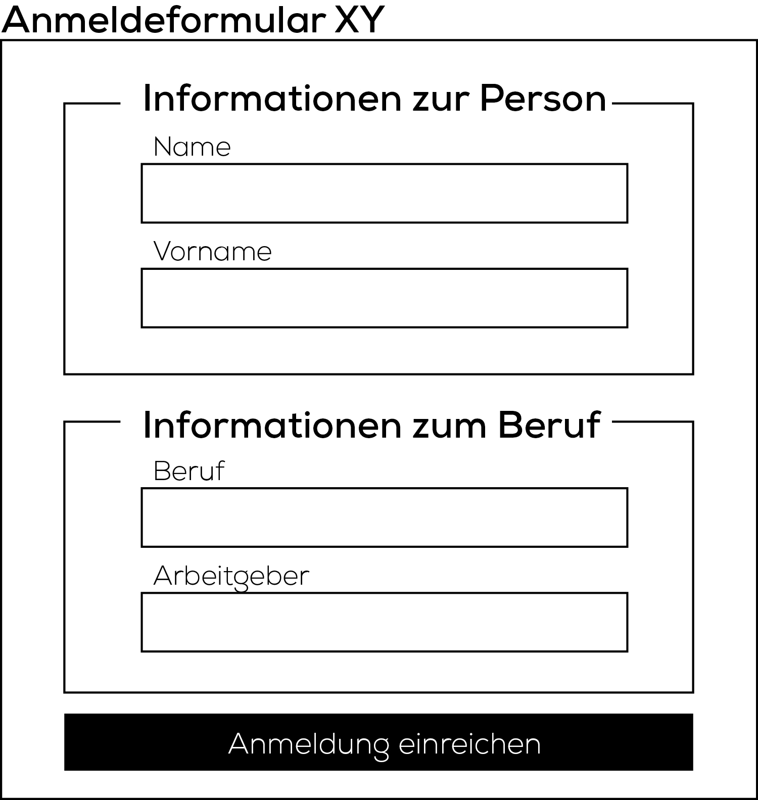

# 01 Informationsgruppierung

Die Übertragung von Informationen mit Hilfe eines Formularfeldes folgt klaren Regeln und Strukturen. Somit lassen sich Formularelemente grundsätzlich in drei hierarchische Stufen unterteilen:

1. Formularfelder \(Textfeld, Checkbox, Radio-Box...\)
2. Formularfeld-Gruppe \(Fieldset\)
3. Formular

### 1. Formularfeld

Die Formularfelder sind die kleinsten Elemente innerhalb eines Formulars. Die verschiedenen Typen ermöglichen es dem Benutzer Informationen einzugeben \(Textfelder, Checkboxen...\) und/oder definierte Aktionen des Formulars auszulösen \(Submit, Reset\).

```markup
<label for="firstname">Vorname</label>
<input type="text" id="firstname" name="firstname">

<label for="lastname">Nachname</label>
<input type="text" id="lastname" name="lastname">

<label for="work">Beruf</label>
<input type="text" id="work" name="work">

<label for="workplace">Arbeitgeber</label>
<input type="text" id="workplace" name="workplace">
```

Als kleine Illustration:


Zur Repetition befindet sich unter folgendem Link ein kleines Cheatsheet zum Thema Formularfelder:

[Übersicht der Formularfelder](https://offline.ch/ict/formulare.html)

### 2. Formularfeld-Gruppen

Das Tag `fieldset` ermöglicht es dem Benutzer die Formularfelder in Sets/Gruppen zu strukturieren. Ausschlaggebend für die Unterteilung ist die thematische Zusammengehörigkeit der einzelnen Felder.

Die Formularfeld-Gruppen erleichtern zum einen die Navigation innerhalb des Dokuments und erhöhen gleichzeitig die Accessability der Seite.

```markup
<fieldset>

    <legend>Informationen zur Person</legend>

    <label for="firstname">Vorname</label>
    <input type="text" id="firstname" name="firstname">

    <label for="lastname">Nachname</label>
    <input type="text" id="lastname" name="lastname">

</fieldset>

<fieldset>

    <legend>Informationen zum Beruf</legend>

    <label for="work">Beruf</label>
    <input type="text" id="work" name="work">

    <label for="workplace">Arbeitgeber</label>
    <input type="text" id="workplace" name="workplace">

</fieldset>
```

Als keine Illustration:


Accessability/Barrierefreiheit: Kommunikation in der Weise, dass sie von Menschen mit Behinderung und von älteren Menschen in derselben Weise genutzt werden kann, wie von Menschen ohne Behinderung.

### 3. Formular

Das `form` Tag ist auf der höchsten strukturellen Ebene eines Formulars und beinhaltet sämtliche Formularfelder und Formularfeld-Gruppen. Ein Formularfeld zeigt folgende Charakteristiken:

* Das `form` Tag verfügt über kein Aussehen. Das Aussehen wird von den darin enthaltenen Elementen bestimmt.
* Das `form` Tag definiert die Handhabung eines kompletten und abgesendeten Formulars \(mit Hilfe des `action` Attributs\).
* Das `form` Tag definiert die Methode, mit welcher die Daten versendet werden.

```markup
<form action="http://ict-bz.ch/process.php" method="post">

    <fieldset>

        <legend>Informationen zur Person</legend>

        <label for="firstname">Vorname</label>
        <input type="text" id="firstname" name="firstname">

        <label for="lastname">Nachname</label>
        <input type="text" id="lastname" name="lastname">

    </fieldset>

    <fieldset>

        <legend>Informationen zum Beruf</legend>

        <label for="work">Beruf</label>
        <input type="text" id="work" name="work">

        <label for="workplace">Arbeitgeber</label>
        <input type="text" id="workplace" name="workplace">

    </fieldset>

    <button type="submit" name="form-submit">Anmeldung einreichen</button>

</form>
```

Als keine Illustration:



## Aufgabe: Strukturierung \(Einzelarbeit\)

### Prolog

Die Firma Galaxy Webservices GmbH lädt seine Kunden zu einem Firmenevent nach Davos ein. Dafür wird per Newsletter ein Link zu einem Anmeldeformular versendet.

Für den Event wurde die komplette Vaillant Arena angemietet. Das Eisfeld wird kurzerhand für Vorträge umfunktioniert.

Der Event dauert zwei Tage. Alle Besucher werden deshalb entweder im `InterContinental Davos` oder im `Steinberger Grandhotel Belvédère` für die Übernachtung untergebracht. Die Besucher können selber entscheiden, in welchem der beiden Hotels sie schlafen möchten.

Für die Anreise vom Hotel zur Arena steht ein Shuttle-Bus-Service zur Verfügung. Damit genügend Busse eingesetzt werden, ist es für den Veranstalter wichtig zu wissen, wie viele Besucher diesen Service nutzen werden.

Für alle Besucher werden zudem diverse Abendprogramme veranstaltet.

Pro eingeladene Firma können beliebig viele Personen am Event teilnehmen. Um den Verwaltungsaufwand klein zu halten, können die einzelnen Personen nicht individuell wählen wo sie schlafen oder an welchem Abendprogramm sie teilnehmen möchten. Es wird immer die komplette Firma zusammen untergebracht, beziehungsweise nehmen alle Mitarbeiter am gleichen Abendprogramm teil.

Dein Chef hat bereits probiert das Projekt umzusetzen. Am Rand der Verzweiflung bittet er dich jedoch darum, das Projekt fortzusetzen.

### Auftrag

Erstelle die neue View `form.view.php` mit der dazugehörigen Routes-Eintrag und dem passenden Controller.

Erstelle in der Datei `form.view.php` ein HTML-Grundgerüst und kopiere folgende Formularfelder in den Body-Bereich, welche von deinem Chef erstellt wurden.

```markup
    Wir möchten den Shuttle-Bus-Service beanspruchen: 
    <input value="1" type="checkbox" name="shuttlebus"><br>

    Name: <input type="text"><br>

    Wie viele Personen werden von Ihrer Firma teilnehmen?:
    <input min="0" type="number" name="num_persons"><br>

    Telefon: <input type="text" name="phone"><br>

    Haben Sie sonst noch einen Wunsch oder eine Bemerkung?
    <textarea name="note" id="note" rows="3"></textarea><br>

    In welchem Hotel möchten Sie übernachten?
    <input type="radio" name="hotel" value="InterContinental Davos">
    <input type="radio" name="hotel" value="Steinberger Grandhotel Belvédère"><br>

    Email: <input type="email"><br>

    <input type="submit" name="submit" value="Anmelden">

    Was möchten Sie am Abend unternehmen?
    <select name="activity">
        <option value="">Kein Abendprogramm</option>
        <option value="Billardturnier">Billardturnier</option>
        <option value="Bowlingturnier">Bowlingturnier</option>
        <option value="Weindegustation">Weindegustation</option>
        <option value="Asiatischer Kochkurs">Asiatischer Kochkurs</option>
        <option value="Tankzurs für Webentwickler">Tankzurs für Webentwickler</option>
        <option value="Ying &amp; Yang Yoga Einsteigerkurs">Ying &amp; Yang Yoga Einsteigerkurs</option>
    </select><br>
```

Ordne das Chaos, welches dein Chef verursacht hat mit den HTML-Tags `fieldset` und `label`. Kontrolliere ausserdem ob die Forumlar-Tags sämtliche nötigen Informationen enthalten.

## Aufgabe: Formular

Sorge dafür, dass das Formular an die URI `validation` per `POST`-Methode gesendet wird.

