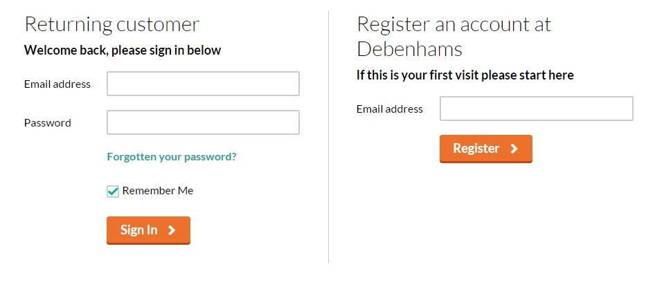
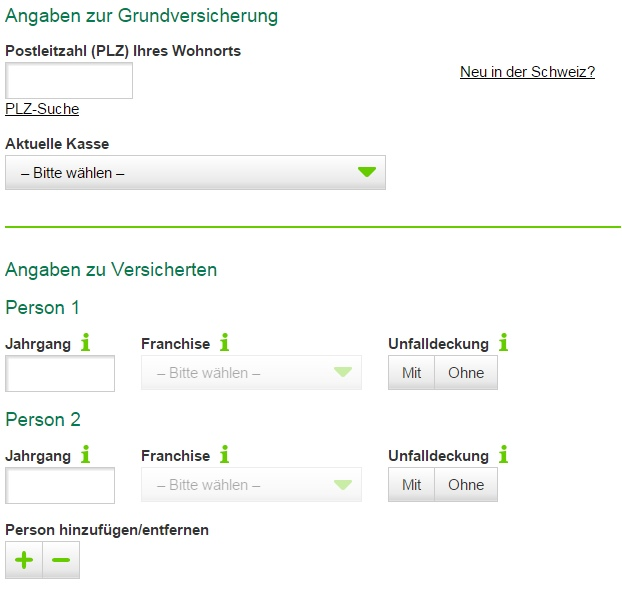
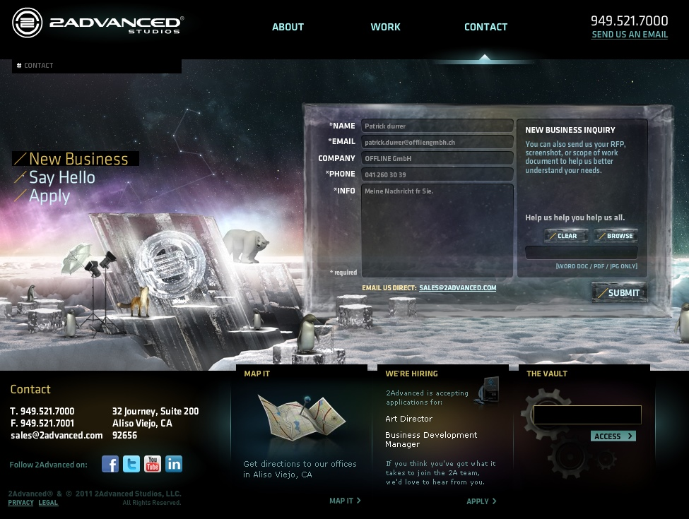
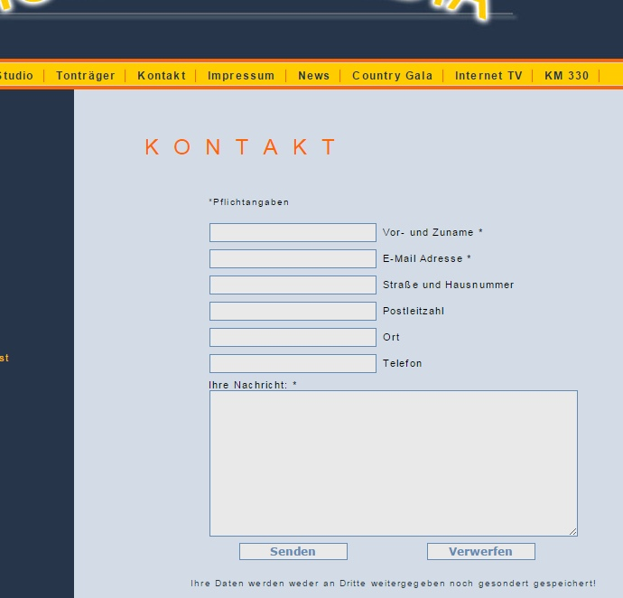

# 02 Design- und Strukturgrundlagen

Zum Einstieg ein kleines Video wieso User Experience und User Design wichtig sind: [User Experience beim SBB-Automaten.](https://www.youtube.com/watch?v=2HdIflrLSLg)

## User Experience

> «User experience» encompasses all aspects of the end-user's interaction with the company, its services, and its products.

[http://nngroup.com/](http://www.nngroup.com/articles/definition-user-experience/)

## UX in Formularen besonders wichtig!

Die User Experience bei Formularen ist wichtig, da zwischen dem Ziel des Benutzers (Kaufen, Beitreten, Bloggen) und dem Ziel des Unternehmen (Verkaufen, hohe Mitgliederzahl, mehr Content) oft ein Formular steht.

Gebrauch von Formularen, auf [Smashing Magazine](http://www.smashingmagazine.com), gemäss [Luke Wroblewski](http://www.lukew.com/resources/web\_form\_design.asp).

* Ein **Formular** macht somit eine Website **nutzbar**.
* Ein **Formular** muss somit **nützlich** sein.

## Die drei Komponenten eines Webformulars

Jedes Webformular besteht grundsätzlich aus drei Komponenten. Um eine positive User Experience zu schaffen muss sich die positive Erfahrung bei der Interaktion mit dem Formular durch sämtliche drei Ebenen ziehen.

1. **Beziehung** - Formulare ermöglichen eine Beziehung zwischen Benutzer und Unternehmen.
2. **Dialog** - Formulare ermögilchen eine Konversation zwischen Benutzer und Unternehmen.
3. **Aussehen** - Erst mit dem richtigen Aussehen und einer logischen Struktur ermöglichen das Formular den Aufbau einer Beziehung und eines Dialogs.

### Beziehung

Ein Formular kann die Beziehung zwischen Benutzer und Unternehmen aufbauen und verstärken. Dies bedeutet jedoch auch, dass ein schlechtes Formular eine Beziehung beenden oder schwächen kann.

* **Eine Beziehung basiert auf Vertrauen.** Somit muss das Formular vertrauenswürdig sein. Dies kann durch das allgemeine Design, Logo, Fotos, Farben, Typographie oder Wording erreicht werden. Der Benutzer muss sofort wissen, dass das hinter dem Formular eine seriösen Firma steht.
* **Jede Beziehung hat ein Ziel.** Ob in einer romatischen Beziehung oder bei Businesspartnern, jede Beziehung hat ein Ziel. Was hat dein Formular für ein Ziel?
* **Passt der Name des Formulars zum Inhalt?** Die Frage ist hier ob der Inhalt (Formularfelder) mit den Erwartungen des Benutzers übereinstimmen. Die Erwartungen des Benutzers werden im Link, Titel, Email etc. aufgebaut, mit dem er auf das Formular gelangt ist.
* **Passt das Formular zu meiner Zielgruppe?** Es ist wichtig zu wissen, wer das Formular ausfüllt und was für Besonderheiten sich daraus schliessen lassen.

Anmeldeformular auf [www.debenhams.com](https://github.com/IctBerufsbildungZentralschweiz/modul-307/tree/a7ffb3b379a75c7c306b125e512297895b0f829d/Tag%202/01%20Formulare%20Theorie/02%20Design-%20und%20Strukturgrundlagen/www.debenhams.com) - die Bereiche für die unterschiedlichen Zielgruppen sind klar differenzierbar.

* **Die Grenzen des Formulars kennen.** Das Formular darf keine Fragen enthalten, welche über den Sinn des Formulars hinausgehen - ansonsten wird der Benutzer misstrauisch.
* **Menschen lieben Konstanz.** Darum ist es wichtig keine plötzlichen Änderungen in der Struktur und im Aussehen des Formulars einzubauen. Der Benutzer darf nicht in seinem 'Flow' unterbrochen werden.

### Dialoge

Ein Formular ist keine einseitige Kommunikation, sondern ein Gespräch zwischen mehreren Parteien - ein Dialog. Somit muss immer im Hinterkopf behalten werden, dass der Benutzer ein Formlar ausfüllt um ein Gespräch mit dem Unternehmen zu beginnen.

* **Ein Formular ist somit ein Gespräch und kein Verhör.** Aggressives und herrscherisches Wording lösen beim Benutzer eine Abwehrhaltung aus.
* **Dem logischen Aufbau einer Konversation folgen.** Ein Formular muss einen logischen Aufbau aufweisen. Du würdest doch auch nicht in den ersten 5 Sekunden des Kennenlernens gleich nach der Telefonnummer fragen? Als Grundsatz gilt: Das Formular geht von den allgemeine Fragen (low Involvement) langsam über zu spezifischen Fragen (high Involvement).
* **Formular nach Themen sortieren.** Menschen denken in Cluster: Fragt ein Formular beispielsweise Informationen über das Auto des Benutzers ab, ruft dieser das Cluster «Auto» in seine Gedanken auf. Nun kann er sämtliche Informationen über sein Auto schnell abrufen und das Formular ausfüllen.

Formularstruktur auf [www.comparis.ch](https://github.com/IctBerufsbildungZentralschweiz/modul-307/tree/a7ffb3b379a75c7c306b125e512297895b0f829d/Tag%202/01%20Formulare%20Theorie/02%20Design-%20und%20Strukturgrundlagen/www.comparis.ch) - Die Informationsgruppen sind optisch und inhaltlich klar aufgeteilt.

* **Pausen einbauen.** Viele Benutzer fühlen sich vor allem von grossen Formularen überrumpelt. Dem kann entgegengewirkt werden, indem gezielt Abstände oder Seitenumbrüche in das Formular eingebaut werden.
* **Ablenkungen entfernen.** Wie bei einem richtigen Dialog, stören Ablenkungen den Gesprächsfluss. Darum ist es wichtig den Fokus auf das Formular zu setzen und unnötige Ablenkungen zu eliminieren.

Anmeldeformular für Unternehmen auf [www.dropbox.com](https://github.com/IctBerufsbildungZentralschweiz/modul-307/tree/a7ffb3b379a75c7c306b125e512297895b0f829d/Tag%202/01%20Formulare%20Theorie/02%20Design-%20und%20Strukturgrundlagen/www.dropbox.com) - Die gesamte Seite wirkt sehr reduziert. So ist es möglich den Fokus komplett auf das Kaufformular zu richten.

### Aussehen

Das Aussehen eines Formulars ist entscheidend für dessen Benutzerfreundlichkeit. Es gibt verschiedene Grundsätze und Tipps um das Aussehen eines Formulars zu gestalten:

#### Label

* **Wörter vs. Sätze.** Sätze machen es dem Benutzer bei komplexeren Fragestellungen einfacher das Feld auszufüllen. Hingegen kann der Benutzer sich bei einfachen Wörtern besser orientieren. Damit gibt es hier keine Grundregel, das Label muss je nach Situation angepasst werden.

Anmeldeformular bei Amazon [www.amazon.ch](https://github.com/IctBerufsbildungZentralschweiz/modul-307/tree/a7ffb3b379a75c7c306b125e512297895b0f829d/Tag%202/01%20Formulare%20Theorie/02%20Design-%20und%20Strukturgrundlagen/www.amazon.ch) - Die Anmeldeseite von Amazon nutzt ganze Sätze, obwohl einzelne Wörter absolut ausreichend sind.

* **Position des Labels.** Auch hier gibt es keine abschliessende Regel und die unterschiedlichen Positionen des Labels bieten verschiedene Vor- und Nachteile. Hier findest du eine kleine Übersicht über die verschiedenen Positionen des Labels: [Überblick über Label-Positionierung](http://media.mediatemple.netdna-cdn.com/wp-content/uploads/2011/10/00-Table-webform-alignment.jpg)
* **Nur eine Kolonne.** Der Aufbau eines Formulars sollte sich nicht über mehrere Spalten ziehen, sondern klar dem Verlauf von oben nach unten folgen.

Zweispaltiges Layout für Kontaktfomular [www.steinegger-elektro.ch](http://www.steinegger-elektro.ch)

#### Formularfelder

* **Feldtypen richtig einsetzen.** Beim Erstellen eines Formularfeldes sollte man sich stets folgende Frage stellen: Welches Feld eignet sich am besten für die gewünschte Information?
* **Gestaltung der Formularfelder.** HTML5 und CSS3 bieten eine Vielfalt von verschiedenen Varianten um ein Formularfeld zu gestalten. Diese sollten jedoch nur beschränkt eingesetzt werden. Es ist wichtiger dem Benutzer eine einfache und intuitive Oberfläche zu bieten als ein schön gestaltetes aber benutzerunfreundliches Formular zu designen (Beispiel Pflichtfeld mit \*).

Ein zu kreatives Kontaktfomular [www.2advanced.com](http://www.2advanced.com) - Kreativität nie vor Funktionalität.

#### Aktionen

* **Primäre und Sekundäre Aktionen unterscheiden.** Die primäre und die sekundäre Aktion eines Formulares müssen optisch klar unterschieden werden. So wird der Button für das Versenden des Formulars anders dargestellt als der Button für das Abbrechen.

Klare Unterscheidung der Aktionen [www.hooklinemusic.de](http://www.hooklinemusic.de). Die Aktionen auf den Buttons sind optisch nicht in eine primäre und eine sekundäre Aktion differenzierbar.

* **Aktionen benennen.** Aktionen wie «Submit» oder «Reset» sollten nach den eigentlichen Aktionen beschriftet werden. Beispielsweise «Registrieren», «Anfrage senden» etc.

## Aufgabe

Tausche den Platz mit deinem/r Nachbar/in und schau sein/ihr Formular im Browser an (nicht den Code). Vergleiche es mit den obigen Empfehlungen und schreibe ein paar Feedback-Punkte auf:

* 2-3 Aspekte, die du benutzerfreundlich findest, die mit den Empfehlungen (oben) übereinstimmen.
* 2-3 Empfehlungen, was noch verbessert werden kann.

Wenn du fertig bist, tauscht eure Feedbacks aus.

Zeit: 10 Minuten inkl. Austausch.
